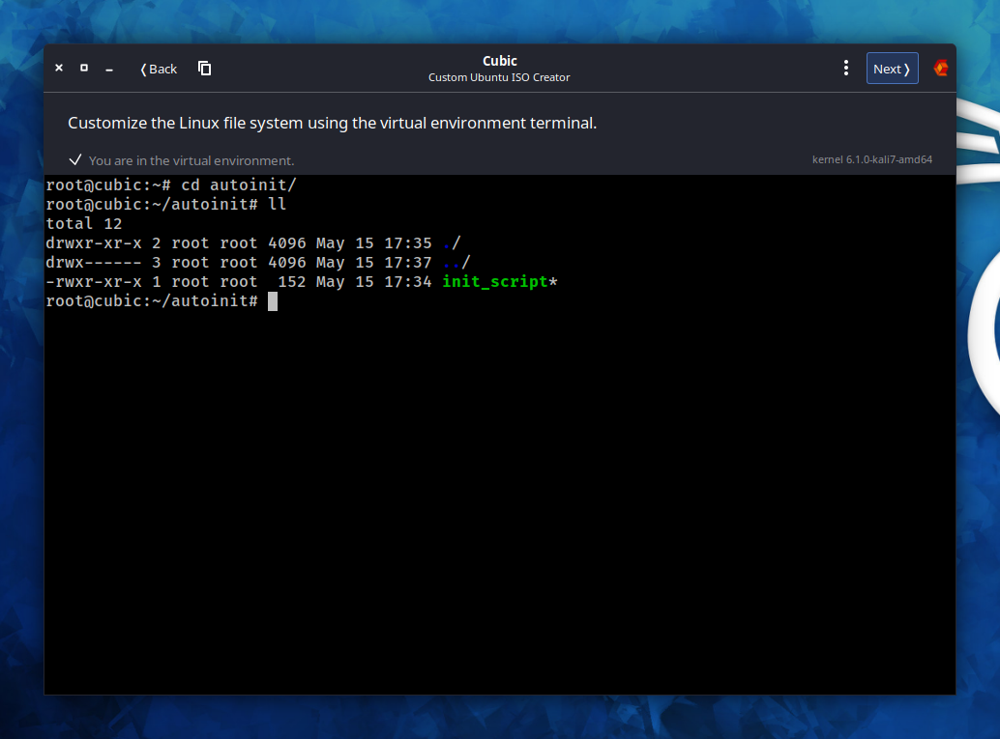

# Autoinit
Setting any script execution once OS is installed. The manual is intended to use for Ubuntu image being edited on Ubuntu OS with `Custom Ubuntu ISO Creator - CUBIC`

## Unpack image
- Create directory to unpack
- Run CUBIC and choose the directory where will be unpacked installation image and OS file system.  


## Customize image
- Then press `Next` button and without any changes press `Customize`.
- Here is a virtual environment where can be loaded any files and installed any packages as well as in usual installed system.
- Create directory `/root/autoinit` and move into in. Being there press button at top left window corner to copy some files. Files placed now in `src/autoinit` of the project have to be loaded to `/root/autoinit` in virtual environment.
- Also, permissions has to be granted to files marked with green color at screenshot below.

>> Note, there is in `init_address` file a variable named `last_byte` and equals to 253. This is 4th byte of addres that will be set at first for temporary and the next, will be released. For example, if network is `10.10.31.0/24`, so for primary setting `10.10.31.253` will be busy.



- Then press `Next`. Wait a few seconds.
- In case ubuntu autoinstall configuration is set, get `Boot` tab, open `grub.cfg` file and inside first `menuentry` change command `linux /casper/vmlinuz ---` to `linux /casper/vmlinuz autoinstall`. As well, `timeout` can be change from 30 to 1 - this is the time (in seconds) is given at start installation to choose some options. But in case automatic installation, no need to wait 30 seconds.  


## Create new custom image
- Then press `Next`, stay choosen `gzip` as optimal and press `Generate`.
- New image will be built in the same directory


## Edit image with installation configuration
- Some additional option to mage with installation configuration have to be added.  

>> How to create image with installation configuration described in README placed to `src/autoinstall_source` of the project.  

- This is `late-commands` option that is needed to be added into installation configuration. Now, it has to be like:
```
#cloud-config
autoinstall:
  version: 1
  identity:
    realname: ubuntu
    hostname: ubuntu-host
    password: "$1$r6RkYJRy$dpxT9aD/TQUIXfTMcOROH0"
    username: ubuntu
  locale: en_US.UTF-8
  refresh-installer:
    update: no
  storage:
    layout:
      name: lvm
  ssh:
    install-server: false
  late-commands:
    - echo "10.10.31.0 24" > /target/root/autoinit/address
    - bash /target/root/autoinit/init_address `cat /target/root/autoinit/address`
    - echo "@reboot root /bin/bash /root/autoinit/init_script" > /target/etc/cron.d/autoinit
    - chmod 755 /target/etc/cron.d/autoinit
```

- `10.10.31.0 24` - is an network and mask where new free address will be seeking
- No need to change all the rest.
