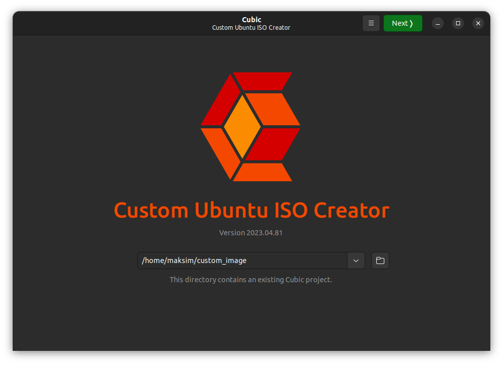
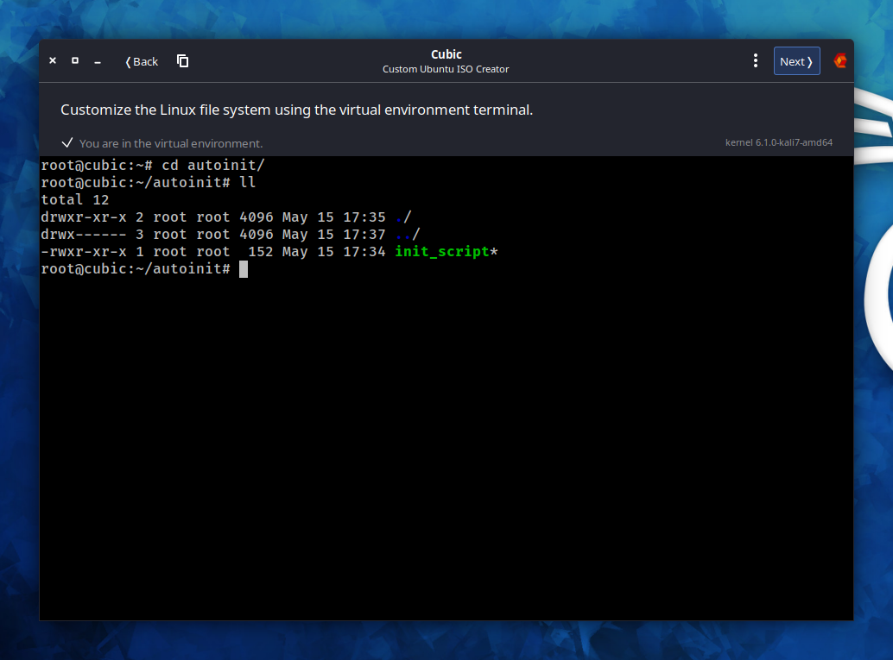

# Ubunti autoinstall
The manual is intended to use for official Ubuntu image being edited with `Custom Ubuntu ISO Creator - CUBIC`.

[Back to main README.md](../../README.md)

## Unpack image
- Create directory to unpack
- Run CUBIC and choose the directory where will be unpacked installation image and OS file system.  

## Customize image
- Then press `Next` button and without any changes press `Customize`.
- Here is a virtual environment where can be loaded any files and installed any packages as well as in usual installed system.
- To have possibility execute some bash command right after installation is end, edit file `src/ubuntu_autoinstall/autoinit/init_script`, but leave 2 last commadns without changes. In virtual environment create directory `/root/autoinit` and move into in. Being there press button at top left window corner to copy some files. Files placed now in `src/ubuntu_autoinstall/autoinit` have to be loaded to `/root/autoinit` in virtual environment.
- Also, permissions `755` has to be granted to files marked with green color at screenshot below.

- Then press `Next`. Wait a few seconds.
- In case ubuntu autoinstall configuration is set, get `Boot` tab, open `grub.cfg` file and inside first `menuentry` change command `linux /casper/vmlinuz ---` to `linux /casper/vmlinuz autoinstall`. As well, `timeout` can be change from 30 to 1 - this is the time (in seconds) is given at start installation to choose some options. But in case automatic installation, no need to wait 30 seconds.  

## Create new custom image
- Then press `Next`, stay choosen `gzip` as optimal and press `Generate`.
- New image will be built in the same directory

[Back to main README.md](../../README.md#get-customized-ubuntu-image)
